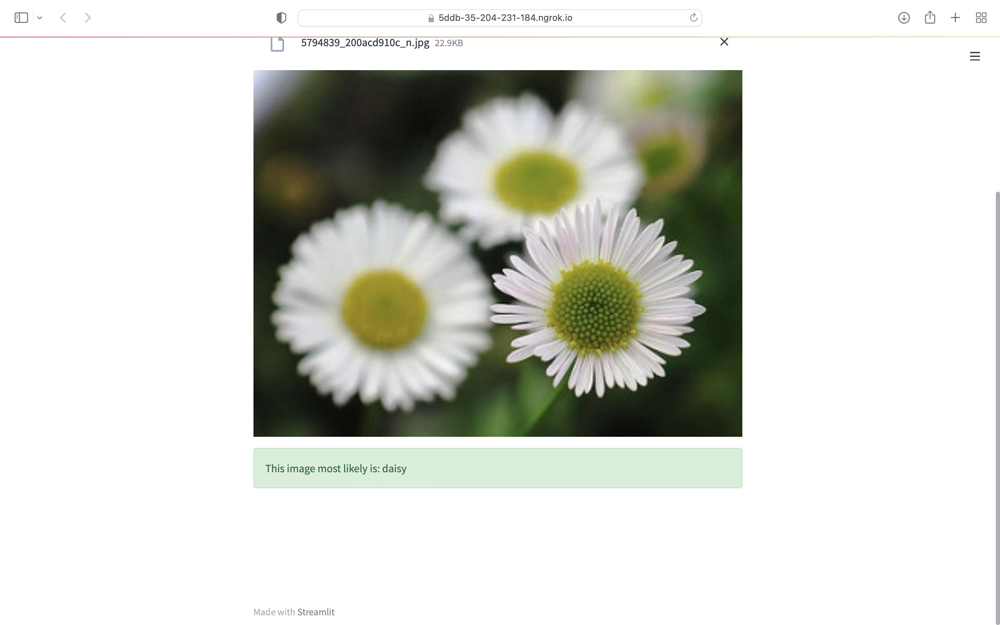

# Flower-Classification-WebApp-Streamlit
Deploy a deep learning keras model onto a web app using Streamlit.
Steps to create the project:
1. Train a image classifier in tensorflow and keras and then saving the model in google collab. 
2. Then create a web application using streamlit and finally host the web server on the internet using ngrok application.

You will be able to deploy the ml web app directly from google collab.(Deep learning model deployment directly from google colab)
Dataset Link- https://storage.googleapis.com/download.tensorflow.org/example_images/flower_photos.tgz

Folder Structure:-

Screenshots of Web App:-

