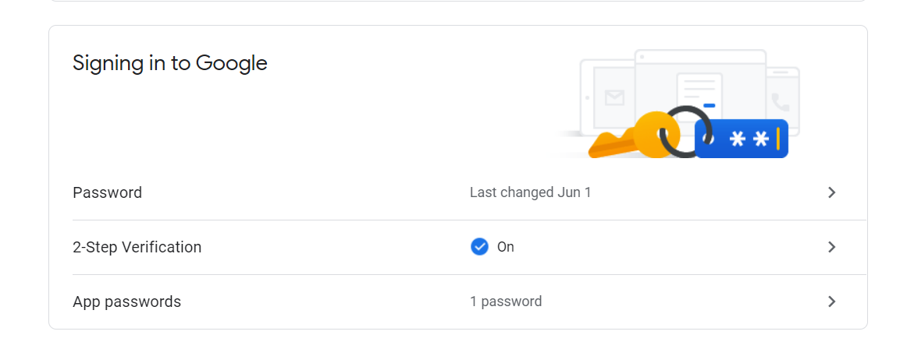
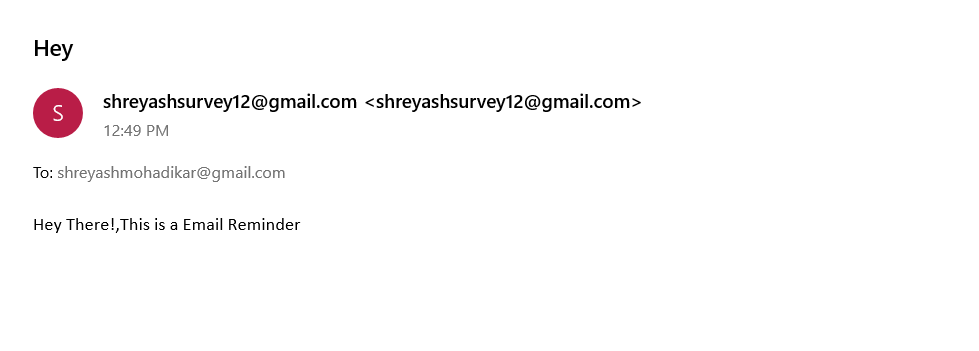

# Send Reminder Emails and Text Notifications
### Python script to send emails and text notifications reminders 
#
## Pre-requisites:
### Install some necessary libraries:
```bash 
pip install emails
```

```bash 
pip install secure-smtplib
```

#
### You need to enable "2-Step Verification" & generate "App passwords" for the email you will be using to send emails or text messages.
### You can do this by simply going to https://myaccount.google.com/security
  

#
### Copy & paste the generated app password in required field in the code
  

#
#### Link for list of SMS gateway domain: <a href ="https://kb.sandisk.com/app/answers/detail/a_id/17056/~/list-of-mobile-carrier-gateway-addresses">Click Here</a>

## Result:
  
