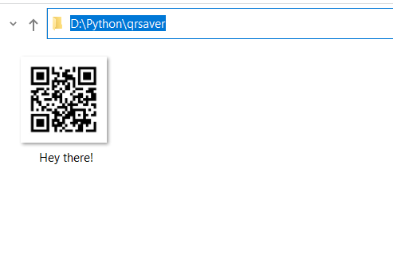

# Generate QR Code of User Text Input
### Python script to generate, save & display QR code images of user input text using pyqrcode library.
### This provides ability to store more information and fast readability

# 
## Packages used:
#### tkinter — python library for gui
#### pyqrcode —  It is a module used to generate QR Code
#### pypng — It allows PNG image files to be read and written 

#

## Installation of necessary packages:
```bash 
pip install pypng
```
```bash 
pip install Pillow
```
```bash 
pip install PyQRCode
```

## Results:
### Generating QR Code
  

### Location of png file that got saved
 

### Scanning the obtained QR Code


