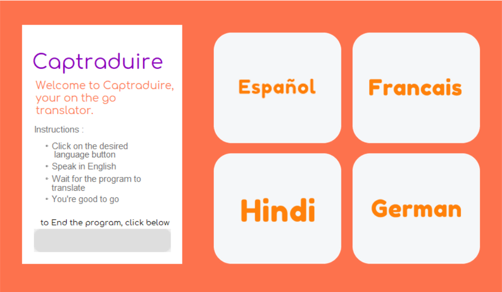

 
 
   
 
 <h1>🍁 Cap-Traduire</h1>

Communication is vital in today's era. Even more important is to have a healthy conversation in official spaces. We come across people hailing from various backgrounds, speaking various languages.

> ### **CAPTRADUIRE** Translates what you speak, for you to have an uninterrupted conversation.  

- It takes the input in the form of English
- Gives output in the desired language on a single click. This program helps communication between two parties easy.

- This software assists you in translating a language into four distinct languages

 

<h1>Instructions:- </h1>
  
 > #### [Set up your environment](./INSTRUCTIONS.md)
 
 After your environment setup complete, follow these steps.

- Open the App 
  The app's layout may be seen here.

- There are four buttons, each button for each language available: Hindi, French, Spanish, and German. 

- Click the button to choose the desired language to translate your words 

- To translate your words speak in English 

- Wait for few seconds your words are being translated into desired output language. 

- When the translation is finished and you want to quit the app, click the exit button in the left corner. 
